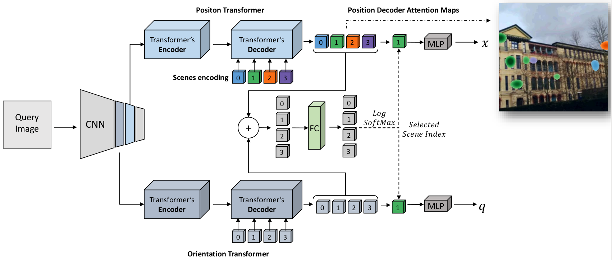

<div align="center">
<h2>A Coarse-to-Fine Residual Prediction for Multi-Scene <br > Pose Regression with Transformers</h2>

[**Yoli Shavit**](https://yolish.github.io/) · [**Ron Ferens**](https://ronferens.github.io/) · [**Yosi Keller**](https://yosikeller.github.io/)

Bar-Ilan University

<a href="https://arxiv.org/abs/2308.11783"></a>
<a href='https://ronferens.github.io/c2f-ms-transfprmer/'></a>
</div>

The official PyTorch implementaiton of [Coarse-to-Fine Multi-Scene Pose Regression with Transformers](https://arxiv.org/abs/2308.11783).<br >
This publication is the extendsion of our ICCV21 paper [Learning Multi-Scene Absolute Pose Regression with Transformers](https://arxiv.org/abs/2103.11468) with coarse-to-fine residual regression.



---

### Set up 
Please follow the instructions (prerequisites) in our the MS Transformer repository: https://github.com/yolish/multi-scene-pose-transformer 


### Pretrained Models 
You can download our pretrained models for the 7Scenes dataset and the Cambridge dataset, from here: [pretrained models](https://drive.google.com/drive/folders/1ehRQuCAFzTnEt4teDc6u6krDVY5SMlG9?usp=sharing) 

If you would like to train our model on these dataset yourself, you will need to initialize them from the respective pretrained ms-transformer models (without residual learning), which are available from our [MS Transformer repository](https://github.com/yolish/multi-scene-pose-transformer). For the CambridgeLandmarks dataset please use the model before fine-tuning.

### Usage

The entry point for training and testing is the main.py script in the root directory

  For detailed explanation of the options run:
  ```
  python main.py -h
  ```
  
  For example, in order to train our model on the 7Scenes dataset run: 
  ```
    python main.py 
    c2f-ems-transposenet 
    train 
    models/backbones/efficient-net-b0.pth 
    /path/to/7scenes-datasets .
    /datasets/7Scenes/7scenes_all_scenes.csv 
    7scenes_config.json 
    --checkpoint_path path/to/pretrained-ms-transformer
  ```
  Your checkpoints (.pth file saved based on the number you specify in the configuration file) and log file
  will be saved under an 'out' folder.
  
  To run on cambridge, you will need to change the configuration file to ```CambridgeLandmarks_config.json``` for initial training and ```CambridgeLandmarks_finetune_config.json``` for fine-tuning (see details in our paper). 
  
  In order to test your model, for example on the ShopFacade scene from the CambridgeLandmarks dataset:
  ```
    python main.py 
    c2f-ems-transposenet
    test
    models/backbones/efficient-net-b0.pth
    path/to/CambridgeLandmarks/
    ./datasets/CambridgeLandmarks/abs_cambridge_pose_sorted.csv_ShopFacade_test.csv
    CambridgeLandmarks_config.json
    --checkpoint_path
    path/to/checkpoint
    --cluster_predictor_position
    ./datasets/CambridgeLandmarks/cambridge_four_scenes.csv_scene_ShopFacade_position_4_classes.sav
    --cluster_predictor_orientation
    ./datasets/CambridgeLandmarks/cambridge_four_scenes.csv_scene_ShopFacade_orientation_4_classes.sav
  ```

  
  
  
